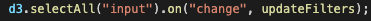
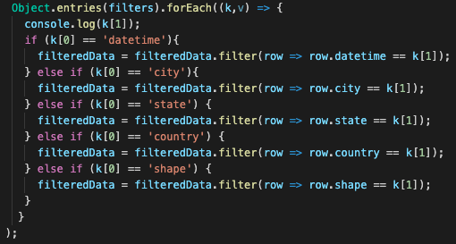
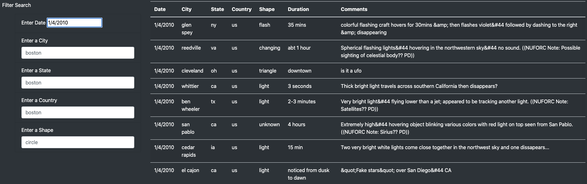
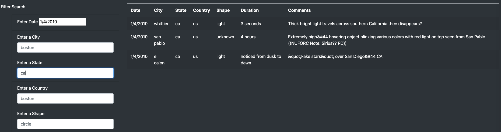
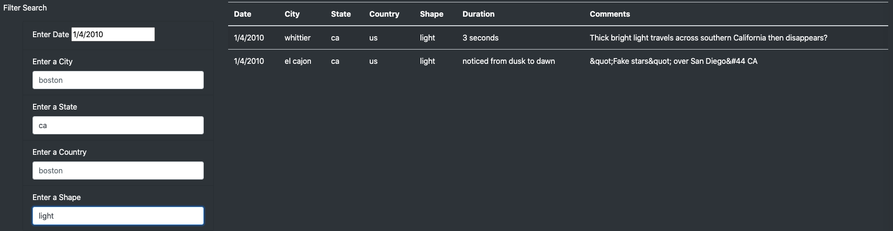

# UFOs Challenge

## Overview of Project
The purpose of this project is to demonstrate the power of javascript as a front-end scripting language for creating dynamic websites with interactive data visualization features.

## Results
The filtering of UFO sighting observations can be further enhanced by providing the user to search by city, state, country and shape.
The following d3 event handler detects changes to each filter: 

The following code in the filterTable() function loops through the 'filters' object:

### Search by Date:
When the user enters the date as filtering criteria, the website shows the table corresponding to that date (i.e. 1/4/2010 in the below example):

### Search by State:
Further more, user can narrow down the search with respect to city, state, country and shape. In the following example, the above search can be filtered based on state "ca":

### Search by Shape:
Finally, the search with respect to "shape" returns the following results:

## Summary
One drawback is user cannot search for specific terms within the comments. 

Following recommendations are proposed to further enhance the user experience: 

- One recommendation is that user could be provided with the search criteria based on duration of UFO observed.
- Second recommendation is that user could also be provided with an option to search for a specific term in the comments section.
